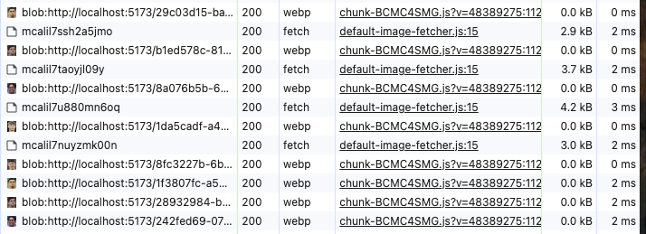

## 📦 Pixstore Example 1: NestJS + Vue + Pixstore Default Endpoint

This example demonstrates **how to use Pixstore’s getImage API** in a real-world, fullstack app (NestJS backend + Vue 3 frontend), and how Pixstore’s built-in automatic image cache cleanup works in the browser.

### **Features**

- 🚀 **GraphQL backend** (NestJS, in-memory player list)
- ⚡ **Vue 3 frontend** with Pinia, Apollo, and Pixstore integration
- 📸 **getImage** usage: fetches images by record, not URL
- 🧹 **Automatic browser cache cleanup** (custom small cache for easy observation)
- 🕵️‍♂️ **Live demo: Inspect images in browser DevTools**

---

## **How it Works**

- Each Real Madrid player has a Pixstore image **record** (not a raw URL).
- The frontend uses `getImage(record)` to **fetch and cache** the image.
- Pixstore’s browser cache is **limited to 5 images** in this demo for easy testing.
- When you select more than 5 unique players, **older images are evicted** from the cache.
- You can see the cache, fetches, and cleanup in real time in DevTools!

---

## **Try It Yourself**

### 1. **Install dependencies**

```bash
npm install
```

### 2. **Run both backend and frontend**

```bash
npm run dev
```

- Backend: [http://localhost:3000/graphql](http://localhost:3000/graphql)
- Frontend: [http://localhost:5173/](http://localhost:5173/)

### 3. **Open the app**

Go to [http://localhost:5173/](http://localhost:5173/) in your browser.


### 4. **Open Developer Tools**

- **Application > IndexedDB > pixstore > images:**
  Watch the cache contents as you click different players.
- 
- **Network tab:**
  Observe fetches to `/pixstore-image/:id` as images are loaded/evicted.
- 
- **Elements/UI:**
  See how player images load instantly if cached, otherwise are fetched from the backend.

---

## **What This Example Shows**

- **How Pixstore’s getImage(record) abstracts image fetching (no direct URLs!)**
- **How browser cache eviction works in real time**
- **How a fullstack app can combine GraphQL, Pixstore, and modern Vue**

---

## **Note**

- In production, you’d use much higher cache limits!
- You can adjust `FRONTEND_IMAGE_CACHE_LIMIT` and `FRONTEND_CLEANUP_BATCH` in `frontend/src/main.ts` to experiment.
- Pixstore is imported from a local build for demo purposes. In your own project, just use:
z"
  ```js
  import { getImage } from 'pixstore/frontend'
  ```

---

**Enjoy inspecting Pixstore under the hood!**
