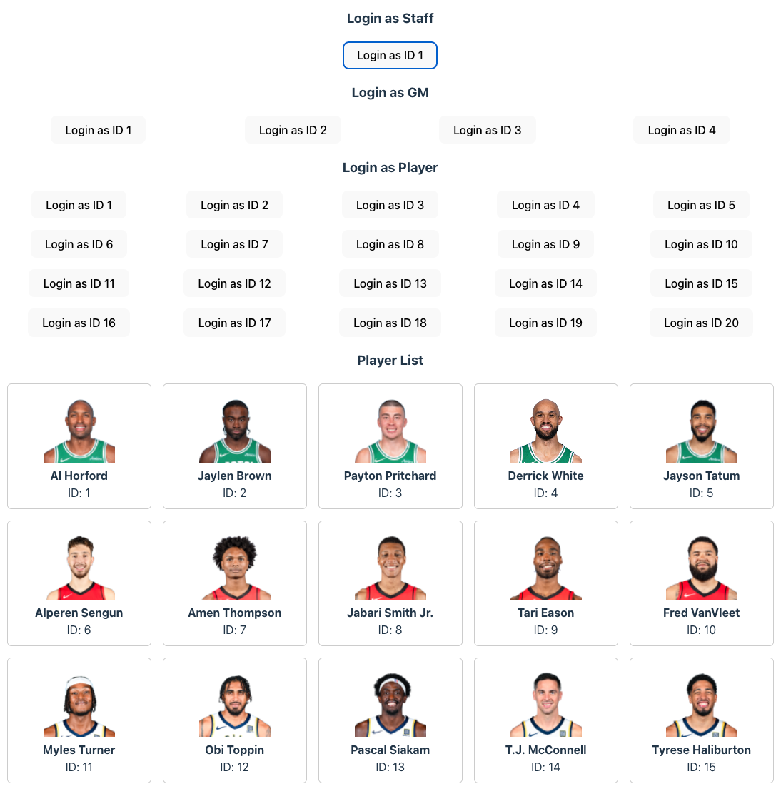

## 📦 Pixstore Example 2: Express + React + Custom Secure Image Endpoint

This example demonstrates **how to use Pixstore with a custom authenticated image endpoint**, in a realistic role-based access scenario (Express backend + React frontend). See how to enforce secure access and how Pixstore’s strict cache cleanup works during rapid/parallel fetches.

---

### **Features**

- 🔒 **Role-based access:** GM (General Manager), Player, Federation Staff, each can see different images based on authorization
- ⚡ **React frontend:** Vite + Zustand + Pixstore integration
- 🛡️ **Custom image fetcher**: Uses JWT for secure image access (no public URLs)
- 🧹 **Strict browser cache cleanup**: Enforces max image count even during parallel fetches
- 🕵️‍♂️ **Live demo:** Inspect image caching and access control in DevTools

---

## **How it Works**

- Each player has an image managed via Pixstore (records, not public URLs).
- The frontend uses a **custom image fetcher** that calls a protected endpoint with JWT and context (playerId).
- The backend validates the user’s JWT and access rights for every image fetch.
- Pixstore’s cache is **strictly limited**: excess images are instantly removed, even with parallel/rapid fetches.
- Example users:

  - **Staff:** Can see all player info and all images.
  - **GM:** Can see all player info, but can **only fetch images of players on their own team**. They cannot fetch (or re-fetch) images of other teams' players, but may see their images if already cached.
  - **Player:** Can see only their own info and image.

---

### **Demo Testing Tip**

To make testing easier, GM users can see all player info but **cannot fetch other team players' images**.

- When you log in as a GM, images will be missing for players not on your own team, even though you can see their details.
- You may see more images displayed than the current cache limit (e.g. limit = 11) if you fetch images quickly, because some images are rendered before cleanup runs.
- If you log in as the same GM again (or refresh), you’ll see the image count drops, reflecting the strict cleanup logic.

---

## **Try It Yourself**

### 1. **Install dependencies**

```bash
npm install
```

### 2. **Run both backend and frontend**

```bash
npm start
```

- Backend: [http://localhost:3000/](http://localhost:3000/)
- Frontend: [http://localhost:5173/](http://localhost:5173/)

### 3. **Open the app**

Go to [http://localhost:5173/](http://localhost:5173/) in your browser.



---

## **Custom Image Fetcher Example (Frontend)**

```ts
const customImageFetcher = async (
  imageId: string,
  context: { playerId: number },
) => {
  const jwt = useAuth.getState().jwt
  const { playerId } = context

  const res = await fetch(`${API_BASE}/player-image/${playerId}/${imageId}`, {
    headers: { Authorization: `Bearer ${jwt}` },
  })

  if (!res.ok) throw new Error('Failed to fetch image')
  const arrayBuffer = await res.arrayBuffer()
  return new Uint8Array(arrayBuffer)
}

// Initialize Pixstore frontend: must be called before using any Pixstore features.
initPixstoreFrontend(
  {
    frontendImageCacheLimit: FRONTEND_IMAGE_CACHE_LIMIT,
    frontendCleanupBatch: FRONTEND_CLEANUP_BATCH,
  },
  customImageFetcher,
)
```

---

## **Custom Endpoint Example (Backend)**

```ts
import { customEndpointHelper } from 'pixstore/backend'

export const getPlayerImage = async (
  req: Request,
  res: Response,
): Promise<void> => {
  const imageId = req.params.imageId

  // Authorization checks
  // (see example source for detailed logic)

  try {
    // Use customEndpointHelper to enforce Pixstore security!
    const payload = await customEndpointHelper(imageId.toString())
    res.send(payload)
  } catch {
    res.status(404).json({ error: 'Image not found' })
  }
}
```

---

## **What This Example Shows**

- **How to use Pixstore with a custom, secure image endpoint**
- **How to implement per-user/role authorization for images**
- **How Pixstore enforces strict browser cache limits even with fast/parallel fetches**
- **How to plug Pixstore into a real React/Express stack**

---

## **Notes**

- In production, you’d want more robust authentication and error handling.
- Adjust cache limits in the Pixstore frontend config to test cleanup behavior.

---

**Explore strict, secure, and modern image storage with Pixstore!**
